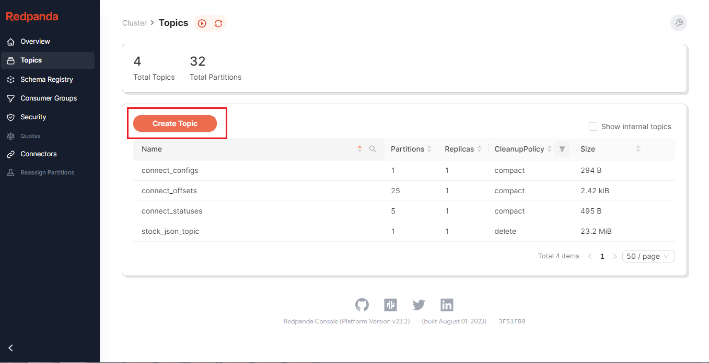
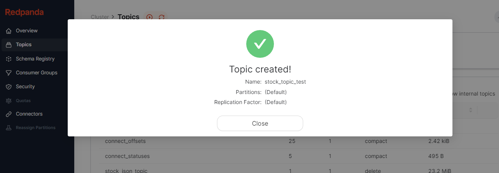
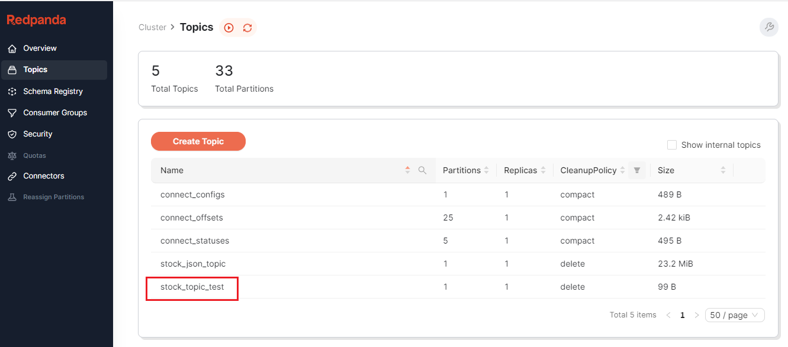
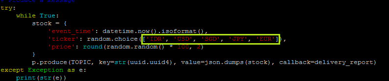
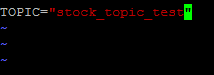
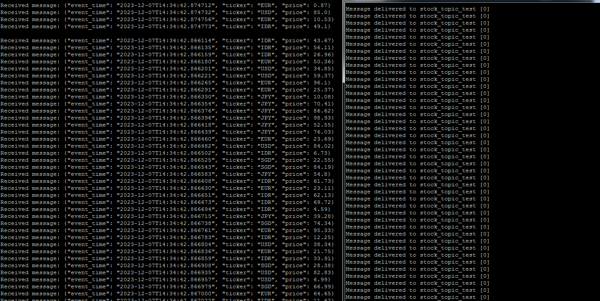
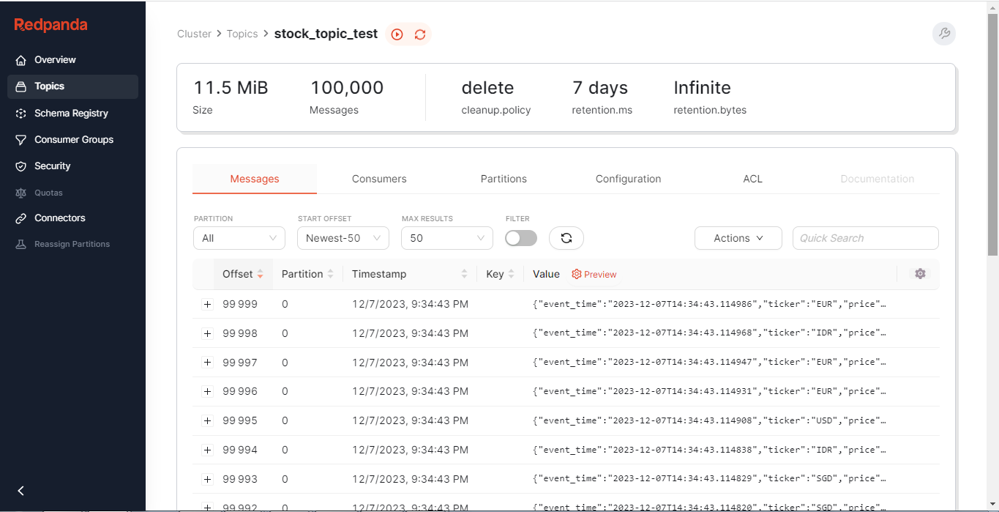

### Task 1
#### 1. Buat topic baru ```stock_topic_test```








#### 2. Ubah file produce.py di bagian ticker dengan ```'IDR', 'USD', 'SGD', 'JPY', 'EUR'```



#### 3. Ganti TOPIC di config.py menjadi ```stock_topic_test```



#### 4. Jalankan produce.py dan consume.py
consume(kiri)-produce(kanan)



#### 5. Messages yang sudah di consume bisa di cek di topic-messages pada UI Redpanda


