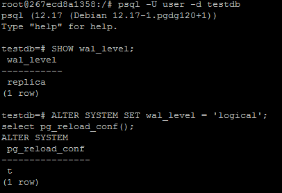
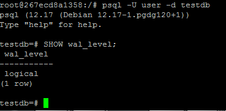
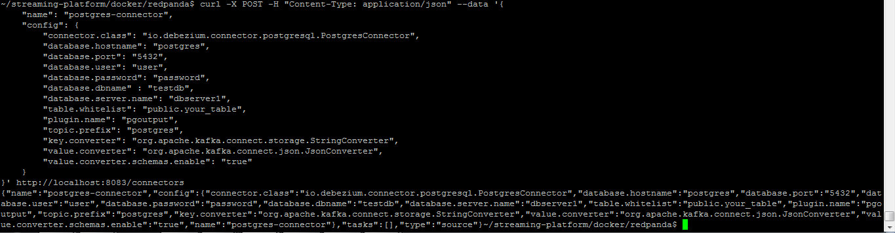
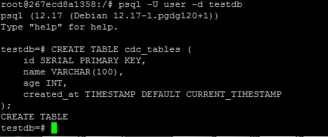
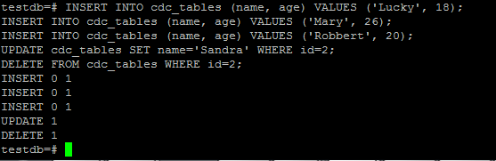
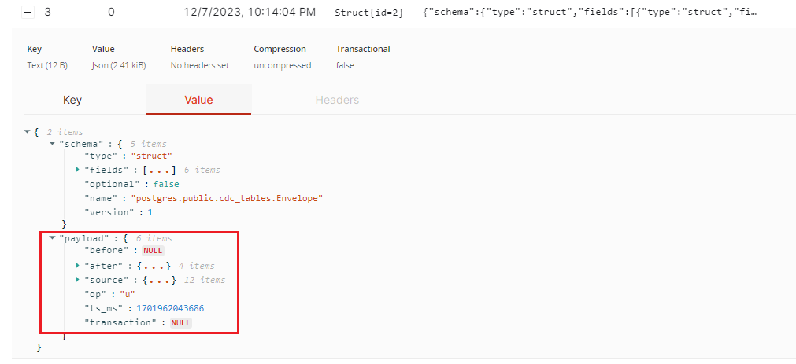

### Task 2
#### 1. Masuk ke postgres, cek wal_level. Jika masih replica, ubah ke logical
```
SHOW wal_level;
```
untuk merubah wal level
```
ALTER SYSTEM SET wal_level = 'logical';
select pg_reload_conf();
```



#### 2. Restart docker compose dan cek wal_level. Pastikan sudah logical



#### 3. Set debezium
```
curl -X POST -H "Content-Type: application/json" --data '{
    "name": "postgres-connector",
    "config": {
        "connector.class": "io.debezium.connector.postgresql.PostgresConnector",
        "database.hostname": "postgres",
        "database.port": "5432",
        "database.user": "user",
        "database.password": "password",
        "database.dbname" : "testdb",
        "database.server.name": "dbserver1",
        "table.whitelist": "public.your_table",
        "plugin.name": "pgoutput",
        "topic.prefix": "postgres",
        "key.converter": "org.apache.kafka.connect.storage.StringConverter",
        "value.converter": "org.apache.kafka.connect.json.JsonConverter",
        "value.converter.schemas.enable": "true"
    }
}' http://localhost:8083/connectors
```



#### 4. Create table ```cdc_tables```
```
 CREATE TABLE cdc_tables (
    id SERIAL PRIMARY KEY,
    name VARCHAR(100),
    age INT,
    created_at TIMESTAMP DEFAULT CURRENT_TIMESTAMP
);
```



#### 5. Lakukan insert, update dan delete
```
INSERT INTO cdc_tables (name, age) VALUES ('Lucky', 18);
INSERT INTO cdc_tables (name, age) VALUES ('Mary', 26);
INSERT INTO cdc_tables (name, age) VALUES ('Robbert', 20);
UPDATE cdc_tables SET name='Sandra' WHERE id=2;
DELETE FROM cdc_tables WHERE id=2;
```



#### 6. Cek messages di Redpanda pada ```topics > postgres.public.cdc_tables```
Dibagian payload, op:c berarti insert, before adalah null dan after adalah data yang diinsert


op:u berarti update, before adalah null dan after adalah data yang diupdate



op:d berarti delete, before adalah data sebelumnya dan after adalah null


