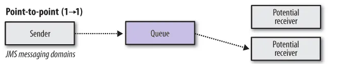
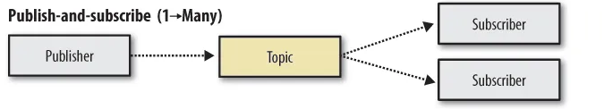
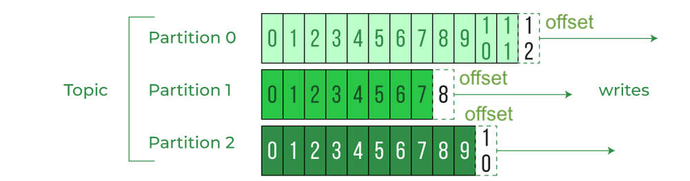
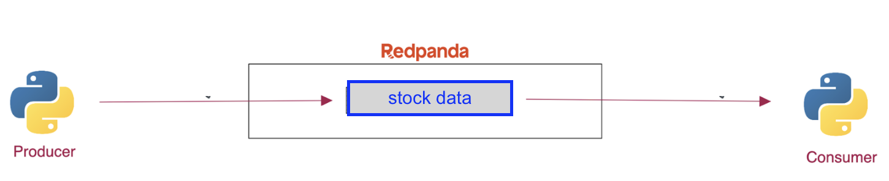
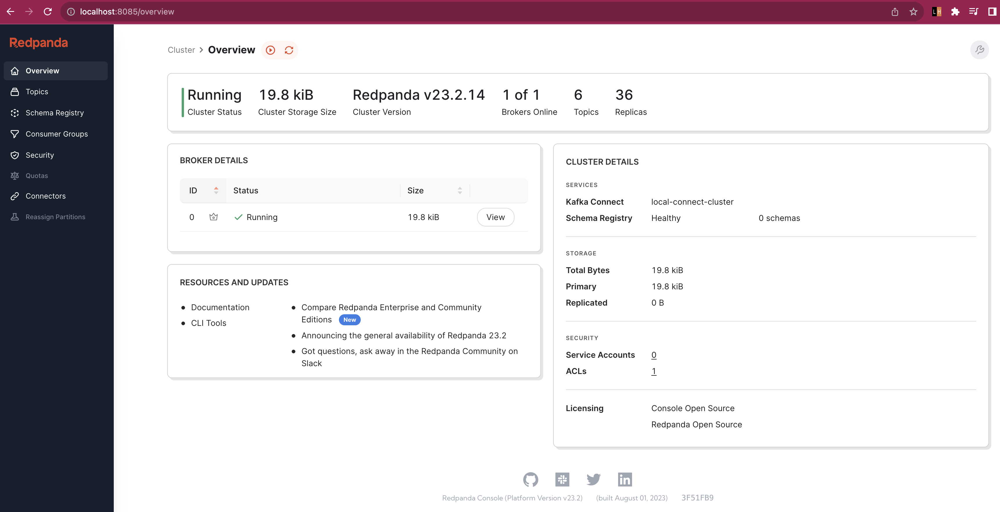
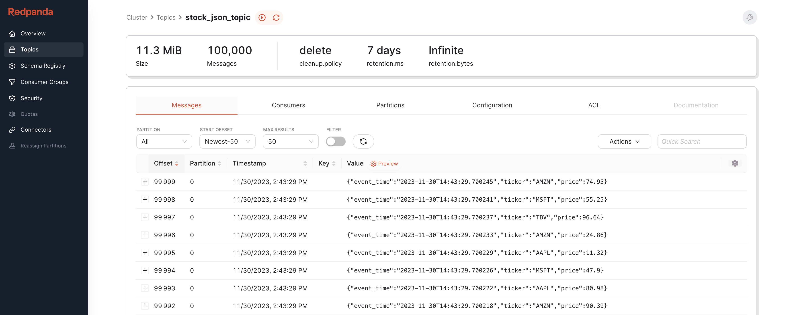

# [Day-1] Introduction to Message Broker

A message broker is a software, that enables services to communicate with each other using messages. As the name implies, a message broker acts as a middleman that shares information between services, even if the services are written in different programming language. Read this [article](https://medium.com/geekculture/streams-vs-pub-sub-systems-in-redis-70626821cc2f) to understand the use-case of message broker. 

Most commons type of message brokers are:
- point-to-point
- publish subscribe

### Point-to-Point

- Messages are put onto a **queue**. Once the messages are arrived, a consumer (that subscribe to a queue) consumes the message, sets acknkowledge status and processes them. The consumed messages will be **deleted** after they are processed. 
- A queue model is also called a **push-based model**. A producer pushes messages to the queues, then the consumers (that listen to the queue) will get the messages.



- An real-world example of this would be queuing at the shops. You stand in one big queue (message queue) with one cashier (consumer), that cashier is processing each shopper (message). Shops open up more cashiers (consumers) to help with the customers (messages). Similar thought process with channels, messages and queues.


- Popular point-to-point message broker tool is RabbitMQ

### Publish/Subscribe
- At a glance it looks similar with queue type, but they are different. A Publish/Subscribe is a messaging model where a message is sent to multiple consumers through a **topic**. The topic is the link between publisher and subscriber. The subscribers may or may not acknowledge the published message, the consumed messages are retained in the topic for some time.

- A publish/subscribe model is also known as **pull-based** model. A pull-based model left the responsibility of fetching messages to consumers. Consumers can decide at which offset (checkpoint) they want to process the message.




- Popular publish-subscribe message broker tool is Apache Kafka.


### What is Stream Processing

Stream processing is the act of processing a continuous flow of incoming data. For example, you are watching the netflix show as the packets arrive, without waiting a whole data are downloaded.

In building a stream pipeline, we need a scalable, high performance, low latency platform that allows **reading and writing streams of data** like a messaging system. Here comes tools such as: Apache Kafka and Redpanda. Throughout this lessons, for the sake of less-complexity and efficient resource, we choose Redpanda over Kafka. 

### What is Redpanda?

Redpanda is a simple, powerful, and cost-efficient streaming data platform that is compatible with Kafka APIs while eliminating Kafka complexity. The difference between Redpanda and Kafka can be read [here](https://docs.redpanda.com/current/get-started/intro-to-events/#redpanda-differentiators). Redpanda shares the same concept of topic, partition and offset as Apache Kafka does.


## Concept of Topics, Partitions and Offset


- Topics represent a particular stream of data. We can have as many Topics as we want and the way to identify a Topic is by its name.

- Partitions are the subset of Topics. 

- Offset is an incremental ID which is the position of the message in the Partition.



A message has a coordinate of a Topic name a Partition id, and an Offset.

For further understanding, please refer to [this article](https://www.geeksforgeeks.org/topics-partitions-and-offsets-in-apache-kafka/)


## [Hands-On] Implementation of Streaming Data Ingestion with Python

Let's create a stock data stream processing with python and redpanda in a docker-compose. A producer.py will publish a dummy stock data to `stock_json_topic` topic in Redpanda and a consumer.py will consume the data stream from `stock_json_topic` topic.



### 1. Spin up redpanda service with docker-compose

- Run the redpanda [docker-compose file](./docker/redpanda/docker-compose.yml) with this command:
```
docker-compose -f docker/redpanda/docker-compose.yml up
```

- If this error pops up: `failed to create network docker_redpanda_network: Error response from daemon: Pool overlaps with other one on this address space`, you should remove the existing network by this command: 

```
docker network rm <network-name>
```

- If an error about the port is conflicting, resolve this by changing the host port to `8085` on `connect` service docker-compose.

```
    ports:
      - 8085:8080
```

- Once all the services are up, access redpanda via [browser](http://localhost:8085):




### 2. Install Python Dependencies 


- First of all, activate your virtualenv and install `confluent_kafka`
```
python -m venv .venv
source .venv/bin/activate
pip install confluent_kafka
```

### 2. Create Publisher 

- The publisher code can be seen [here](./pubsub/json/produce.py). See this [docs](https://docs.confluent.io/platform/current/installation/configuration/producer-configs.html) for the complete producer config.


- The stock data example that we are going to publish to the topic is: 

```
{
    "event_time": "2023-11-30T14:43:29.700245",
    "ticker": "AMZN",
    "price": 74.95
}
```

- Run the publisher file with this command

```
python pubsub/json/produce.py
```

- Now, we can see the published messages on `stock_json_topic` topic in redpanda dashboard




### 3. Create Subscriber/Consumer

- The consumer code can be seen [here](./pubsub/json/consume.py). This code will consume the message and print the stock data on the terminal.


- The consumer `python-consume` will consume the 

- The `group.id` determines which consumers belong to which group. If there are four consumers with the same Group ID assigned to the same topic, they will all read the same topic.

- The `'auto.offset.reset': 'earliest'` config set the consumer to read from the earliest offset in the partition.

```

c = Consumer({
        'bootstrap.servers': 'localhost:19092',
        'group.id': 'python-consumer',
        'auto.offset.reset': 'earliest'
    })

```

- Refer to this [docs](https://redpanda.com/guides/kafka-tutorial/kafka-consumer-config) for a complete consumer config.


- Run the consumer with this command 

```
python pubsub/json/consume.py
```

- See the events/messages in redpanda dashboard


## Improvement on Streaming Data Ingestion Using Avro Schema

Records in a topic are just arrays of bytes. A message broker doesn’t care about the type of data we’re sending. To make those byte arrays useful in our applications, producers and consumers must know how to interpret the schema them. The diagram can be shown below.


Please refer to this sources for more use-cases with schema serializer and deserializer: 

- https://www.tutorialspoint.com/avro/avro_schemas.htm
- https://redpanda.com/blog/produce-consume-apache-avro-tutorial

## [TASK] 

- Create a new topic named `stock_avro_topic`, then publish the stock streaming data with avro schema to the newly created topic


## Reference

- https://tsh.io/blog/message-broker/
- https://serverlessland.com/event-driven-architecture/visuals/queues-vs-streams-vs-pubsub
- https://www.geeksforgeeks.org/topics-partitions-and-offsets-in-apache-kafka/