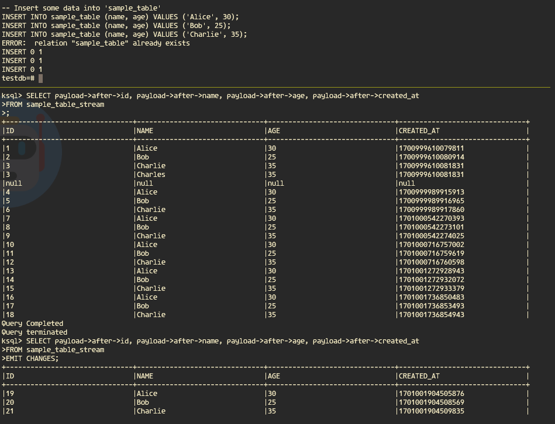

# KSQL

With KSQL, you can access kafka topic using SQL.

```bash
docker exec -it  ksqldb-cli bash
```

Then run the following:

```bash
ksql http://ksqldb-server:8088
```

Create stream, notice that we need to to create a structure that match or kafka topic value.

```sql
CREATE STREAM sample_table_stream (
    payload STRUCT<
        before STRUCT<
            id INT,
            name VARCHAR(100),
            age INT,
            created_at BIGINT
        >,
        after STRUCT<
            id INT,
            name VARCHAR(100),
            age INT,
            created_at BIGINT
        >,
        op VARCHAR(50)
    >
) WITH (
    KAFKA_TOPIC = 'postgres.public.sample_table',
    VALUE_FORMAT = 'JSON'
);
```

The stream reflect what we want to access from our topic value:

```
{
    "schema":{...}
    "payload":{
        "before":NULL
        "after":{
            "id":1
            "name":"Alice"
            "age":30
            "created_at":1701437402641615
        }
        "source":{
            "version":"2.2.0.Alpha3"
            "connector":"postgresql"
            "name":"postgres"
            "ts_ms":1701437402643
            "snapshot":"false"
            "db":"testdb"
            "sequence":"["23518776","23518880"]"
            "schema":"public"
            "table":"sample_table"
            "txId":491
            "lsn":23518880
            "xmin":NULL
        }
        "op":"c"
        "ts_ms":1701437402972
        "transaction":NULL
    }
}
```

Try to show all data.

```sql
SELECT payload->after->id, payload->after->name, payload->after->age, payload->after->created_at
FROM sample_table_stream 
```

Or only the latest changes

```sql
SELECT payload->after->id, payload->after->name, payload->after->age, payload->after->created_at
FROM sample_table_stream 
EMIT CHANGES;
```

